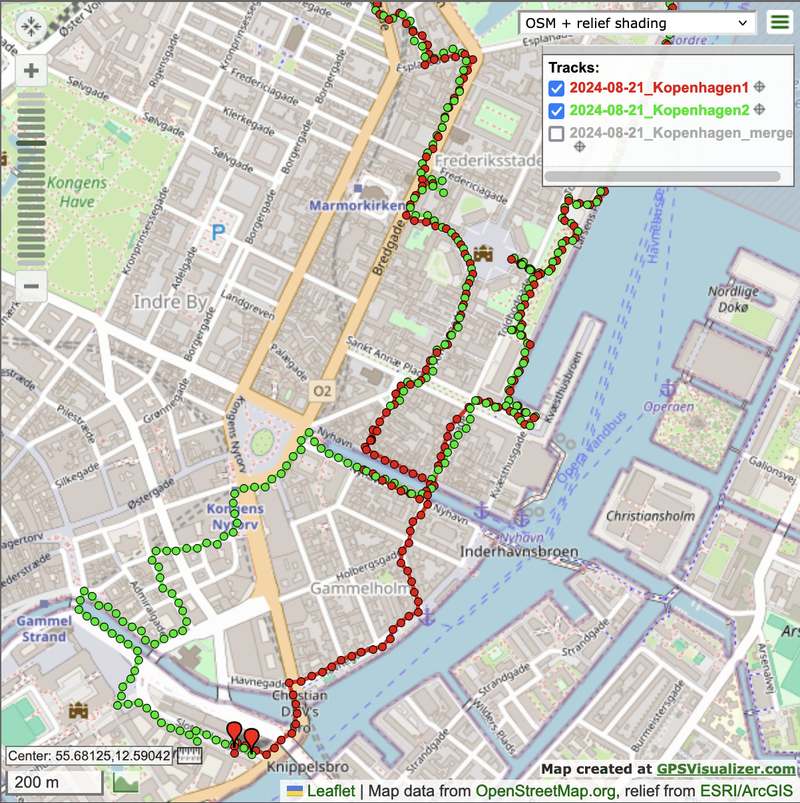
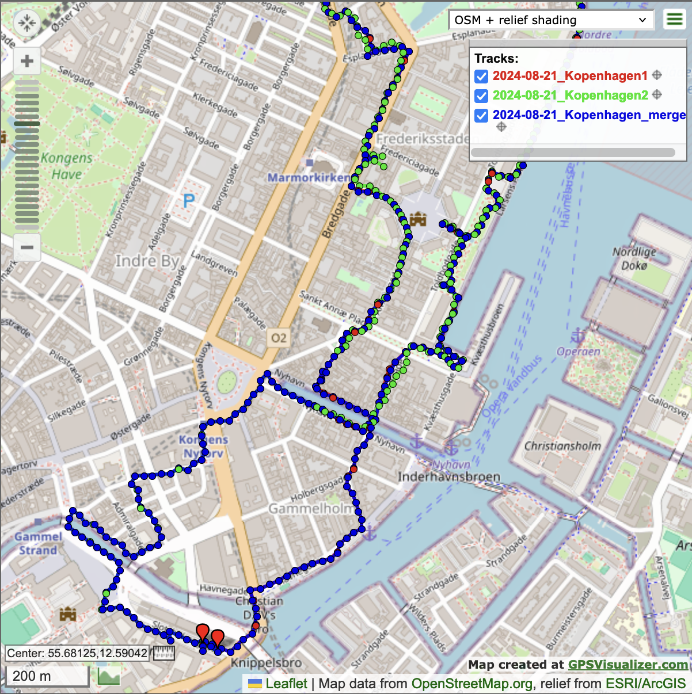

# GPXConv

GPX track converter: post-process routes and tracks produced by GPS loggers etc.

* Reads from file(s) given as argument or STDIN and writes to STDOUT or a file.
* Concatenates segments of multiple given tracks or routes (sequential composition),
  using (header) metadata of the first track, preserving segments, and collecting waypoints.
* Optionally augments main input by merging data from alternative input (from parallel tracks),
  ignoring metadata and segment information of the alternative input.

* Reports statistics including total length and time, moving time, average moving speed and max speed,
  min and max altitude, total ascent and descent, as well as max ascent and descent rate.
* Reports missing data and by default ignores points containing implausible data w.r.t.
  altitude, ascent/descent rate, speed, acceleration/deceleration, and direction change.
* Between segments and on start/end of merged sections, speed and ascent/descent rate are ignored.
* Corrects implausible elevation gain/loss after gaps, typically on exit of tunnel or building
* Optionally filters out points before or after given time limits.
* Optionally filters out points with an element value below or above given limits.
* Optionally prunes comments, extensions, or extension elements with value below or above given limits.
* By default carries over missing altitude and time data between segments.
* By default fills in missing altitude and time data by interpolation within segments.
* By default inserts interpolated points in long time gaps (default 1800 seconds sufficient for exiftool).
* Optionally corrects elevation and and smoothens tracks.
  (Orthometric height = GPS ellipsoidal height - geoid height,
  see http://www.unavco.org/edu_outreach/tutorial/geoidcorr.html)
* Optionally produces additional statistics on a per-segment or per-day basis.
* Optionally analyzes climbing phases with extra ascent/descent and speed statistics.
* Optionally calculates approximate total energy spent by biking along the resulting track.
* Prints information and warnings (unless disabled), as well as any errors, to STDERR.

Usage:
```
  gpxconv <option(s) and infile(s)> [> <outfile>]
```
Command-line options:
```
  -h | -help | --help          - print these hints and exit
  -version                     - print tool name and version and exit
  -swim, -walk, -cycle, -drive, -fly - type of recorded activity, default: drive
  -no_sanitize                 - do not sanitize trackpoints with implausible data
  -no_insert                   - do not insert trackpoints on long time gaps
  -smooth                      - smoothen tracks
  -phases                      - analyze and provide statistics for ascent/descent phases
  -segs [<n>..[<m>][(+|-)<d>]] - add statistics per segment n..m, may adapt indexes +/-d
  -days [<n>..[<m>][(+|-)<d>]] - add statistics per day n..m, may adapt indexes +/-d
  -lean_stat_wpts              - only one stat. wpt per segment/day with data except ascent/descent
  -info_wpts                   - provide info points also in the form of waypoints
  -warn_wpts                   - provide warning points also in the form of waypoints
  -cmt_wpts <pattern>          - add info waypoints for trackpoints with matching 'cmt' element
  -src_wpts <pattern>          - add warning waypoints for trackpoints with matching 'src' element
  -merge <file>                - augment tracks in infile(s) with data from given GPX file
  -weight <value>              - calculate biking energy for given weight in kg
  -begin <time>                - ignore points before given time
  -end <time>                  - ignore points after given time
  -resolution <seconds>        - minimum time difference between trackpoints (on input)
  -min <name> <limit>          - ignore points with element value below limit
  -max <name> <limit>          - ignore points with element value above limit
  -min_ext <name> <limit>      - prune extension elements with value below limit
  -max_ext <name> <limit>      - prune extension elements with value above limit
  -prune_wpts                  - remove waypoints
  -prune_cmts                  - remove comments
  -prune_exts                  - remove track, waypoint, and trackpoint extensions
  -ni                          - do not output information
  -nw                          - do not output warnings
  -o <outfile>                 - output the resulting track to <outfile>
  -debug                       - enable internal consistency checks and debug output
```
Other options can be set by changing values of the configuration variables.

Here is an example for using GPXConv with its `-merge` option
to combine two incomplete partially overlapping track recordings:
```
gpxconv 2024-08-21_Kopenhagen1.gpx  -merge  2024-08-21_Kopenhagen2.gpx -lean_stat_wpts \
      > 2024-08-21_Kopenhagen_merged.gpx 2> 2024-08-21_Kopenhagen_merged.log
```
It is instructive to compare the output of [GPSVisualizer](https://www.gpsvisualizer.com/map_input?form=leaflet)
for the two inputs (in red and green) and the merged result (in blue).

\



<!--
Local IspellDict: american
LocalWords: GPXConv STDOUT STDERR exiftool gpxconv trackpoint trackpoints waypoint
LocalWords: infile outfile nw ni segs ext wpts cmts exts stat wpt cmt src gpx
LocalWords: GPSVisualizer Kopenhagen
-->
